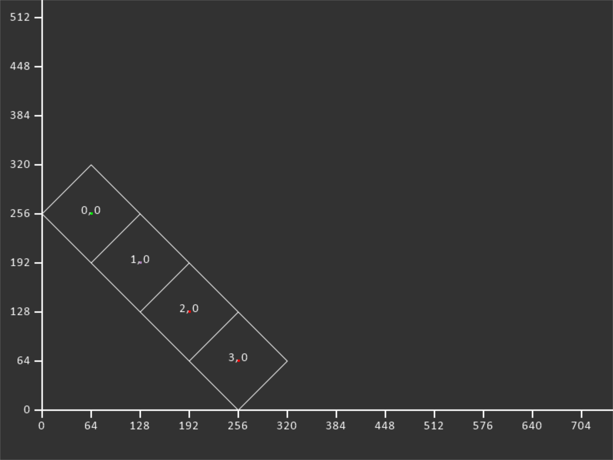

Isometric Coordinates
=====================

Traditional top-down or side-view games normally work in a traditional grid.
Graphics are placed in these grid locations. Each graphic is a rectangle, and
sometimes they are referred to as "tiles."

Converting between grid locations and the screen's pixel coordinates
are reasonably straight-forward.

Another type of 2D game uses "Isometric Tiles." Here, we can fake a
3D view with 2D graphics. We do that by tilting the grid 45 degrees.
Each tile then becomes a diamond.

Unfortunately the math to go from pixels to grid locations is no
longer straight forward.

Equations For Tiles To Pixels
-----------------------------

Equations to go from tile coordinates to screen coordinates.

Variable definitions
~~~~~~~~~~~~~~~~~~~~

Given:

* tilewidth = width of each tile in pixels
* tileheight = height of each tile in pixels
* tilex = x-coordinate of the tile, in tiles
* tiley = y-coordinate of the tile, in tiles
* width = width of the map, in tiles
* height = hieght of the map, in tiles

Result:

* screenx = x-coordinate of the screen in pixels
* screeny = y-coordinate of the screen in pixels

Equations
~~~~~~~~~

.. math::

    screenx = \frac{tilewidth \cdot tilex}{2} + \frac{height \cdot tilewidth}{2} - \frac{tiley  \cdot tilewidth}{2}

.. math::

    screeny = \frac{(height - tiley - 1) \cdot tileheight}{2} + \frac{width \cdot tileheight}{2} - \frac{tilex \cdot tileheight}{2}

Equations For Pixels To Tiles
-----------------------------

Equations to go from screen pixel coordinates to tile coordinates.

This needs to work for any coordinate inside the diamond, not just the center.

Variable definitions
~~~~~~~~~~~~~~~~~~~~

Given:

* screenx = x-coordinate of the screen in pixels
* screeny = y-coordinate of the screen in pixels
* tilewidth = width of each tile in pixels
* tileheight = height of each tile in pixels
* width = width of the map, in tiles
* height = hieght of the map, in tiles

Result:

* tilex = x-coordinate of the tile, in tiles
* tiley = y-coordinate of the tile, in tiles

Equations
~~~~~~~~~

<Insert magic math stuff here.>

Examples
--------

2x2 Grid
~~~~~~~~

.. code-block:: text
    :caption: Parameters

    MAP_WIDTH = 2
    MAP_HEIGHT = 2
    TILE_WIDTH = 128
    TILE_HEIGHT = 128

.. code-block:: text
    :caption: Tile coordinates to screen coordinates (center of tile)

    0, 0 => 128, 192
    0, 1 =>  64, 128
    1, 0 => 192, 128
    1, 1 => 128,  64

3x3 Grid
~~~~~~~~

.. code-block:: text
    :caption: Parameters

    MAP_WIDTH = 3
    MAP_HEIGHT = 3
    TILE_WIDTH = 128
    TILE_HEIGHT = 128

.. code-block:: text
    :caption: Tile coordinates to screen coordinates (center of tile)

    0, 0 => 192, 320
    0, 1 => 128, 256
    0, 2 =>  64, 192
    1, 0 => 256, 256
    1, 1 => 192, 192
    1, 2 => 128, 128
    2, 0 => 320, 192
    2, 1 => 256, 128
    2, 2 => 192,  64

4x4 Grid
~~~~~~~~

.. code-block:: text
    :caption: Parameters

    MAP_WIDTH = 4
    MAP_HEIGHT = 4
    TILE_WIDTH = 128
    TILE_HEIGHT = 128

.. code-block:: text
    :caption: Tile coordinates to screen coordinates (center of tile)

    0, 0 => 256, 448
    0, 1 => 192, 384
    0, 2 => 128, 320
    0, 3 =>  64, 256
    1, 0 => 320, 384
    1, 1 => 256, 320
    1, 2 => 192, 256
    1, 3 => 128, 192
    2, 0 => 384, 320
    2, 1 => 320, 256
    2, 2 => 256, 192
    2, 3 => 192, 128
    3, 0 => 448, 256
    3, 1 => 384, 192
    3, 2 => 320, 128
    3, 3 => 256,  64

4x1 Grid
~~~~~~~~

.. code-block:: text
    :caption: Parameters

    MAP_WIDTH = 4
    MAP_HEIGHT = 1
    TILE_WIDTH = 128
    TILE_HEIGHT = 128

.. code-block:: text
    :caption: Tile coordinates to screen coordinates (center of tile)

    0, 0 =>  64, 256
    1, 0 => 128, 192
    2, 0 => 192, 128
    3, 0 => 256,  64

1x4 Grid
~~~~~~~~

.. code-block:: text
    :caption: Parameters

    MAP_WIDTH = 1
    MAP_HEIGHT = 4
    TILE_WIDTH = 128
    TILE_HEIGHT = 128

.. code-block:: text
    :caption: Tile coordinates to screen coordinates (center of tile)

    0, 0 => 256, 256
    0, 1 => 192, 192
    0, 2 => 128, 128
    0, 3 =>  64,  64

3x3 Squished Grid
~~~~~~~~~~~~~~~~~

The height and width don't have to equal each other. In fact, they
often don't. Here's an example where they are different.

.. code-block:: text
    :caption: Parameters

    MAP_WIDTH = 3
    MAP_HEIGHT = 3
    TILE_WIDTH = 128
    TILE_HEIGHT = 64

.. code-block:: text
    :caption: Tile coordinates to screen coordinates (center of tile)

    0, 0 => 192, 160
    0, 1 => 128, 128
    0, 2 =>  64,  96
    1, 0 => 256, 128
    1, 1 => 192,  96
    1, 2 => 128,  64
    2, 0 => 320,  96
    2, 1 => 256,  64
    2, 2 => 192,  32

Code Example
------------

.. literalinclude:: ../Source/isometric_example.py
    :caption: isometric_example.py
    :linenos:
